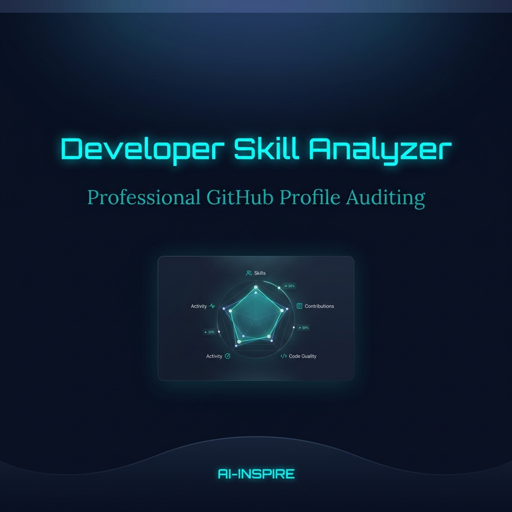

# 🌌 Smart Resource Allocation

### **AI-powered Volunteer Matching Platform**

---

## 🚀 The Vision
**Smart Resource Allocation** is an AI-powered platform designed for seamless volunteer matching and resource management. Built with a clean, high-contrast minimalist aesthetic, it ensures that every resource is utilized where it's needed most.

## ✨ Design Specifications
- **Minimalist Backdrop**: A deep `#0a0f14` foundation with a subtle horizontal gradient header.
- **Neon Cyan Accents**: High-visibility `#00ffcc` typography for a futuristic, digital feel.
- **Organic Geometry**: A single, subtle dark curved wave at the base for section fluidity.
- **Clean Typography**: Sans-serif (Inter) focused on readability and professional balance.

---

## 🛠️ Tech Stack
| Component | Technology |
| :--- | :--- |
| **Framework** | React 19 + Vite |
| **Styling** | Tailwind CSS v4 |
| **Infrastructure** | Serverless Architecture |
| **Labeling** | AI-Inspire System |

---

  <h2 style="color: #00ffcc;">AI-Inspire</h2>
  Developed by Aditya Sing

