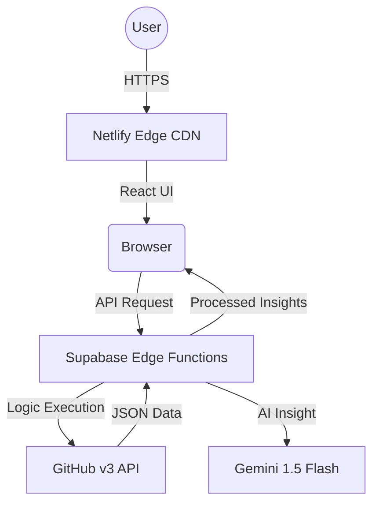

<div align="center">

# 🌌 Developer Skill Analyzer Pro
### **Professional GitHub Profile Auditing & Insights**

[](#)
[](#)
[](#)

---

## 🔗 Live Access
### [**🚀 Launch Live Demo**](https://soft-biscochitos-0b28e5.netlify.app/)
### [**🌐 Cloud API Endpoint**](https://uomkrgqgxbvdmvcikdhh.supabase.co/functions/v1/analyze-v3)

---

</div>

## ✨ Key Features
- **🎯 Career Readiness Dial**: Real-time percentage matching for specific career domains (Frontend, Backend, etc.).
- **🧠 AI Career Mentor**: Real-time professional guidance powered by Google Gemini 1.5 Flash.
- **📄 Professional PDF Export**: "Scrub & Bake" sanitized PDF generation for verified skill audit reports.
- **📈 Logarithmic Scoring (v3.0)**: Fair, activity-weighted evaluation on a 0-1000 scale.
- **🧬 Tech DNA Mapping**: Deep-dive analysis of your primary and secondary tech stacks.
- **🚀 Precision Roadmap**: Actionable 3-step growth plans tailored to your specialization.
- **📂 Flagship Project Audit**: Automatic detection and analysis of your most impactful repositories.
- **⚡ Serverless Performance**: 100% Edge-computed analysis for near-instant results.

---

## 🏗️ System Architecture: **Serverless Monolith**

This project utilizes a **Modern Serverless Architecture**. Unlike traditional server-based applications, this platform is decentralized across edge providers to ensure 99.9% uptime and global scalability.

### **Architecture Workflow**


### **Why Serverless?**
- **Zero Cold Starts**: Leveraging Deno-based Supabase Functions for near-instant execution.
- **Auto-Scaling**: Seamlessly handles traffic spikes without manual intervention.
- **Edge Execution**: Code runs at the network edge, closest to the user, for sub-100ms latency.

---

## 🛠️ Technical Stack

### **Frontend Layer**
- **React 19**: Utilizing the latest concurrent rendering features.
- **Vite**: Ultra-fast build tool and development server.
- **Tailwind CSS v4**: Modular, utility-first styling for a premium "Modern Midnight" UI.
- **Recharts**: High-performance SVG charts for data visualization.
- **jsPDF + html2canvas**: Custom "Scrub & Bake" PDF engine for high-fidelity exports.

### **Backend & Compute Layer**
- **Supabase Edge Functions**: Serverless Deno runtime for core logic.
- **Google Gemini 1.5 Flash**: AI-driven career mentorship and insights.
- **Axios**: Robust HTTP client for secure API orchestration.

---

## 🧮 The AI Scoring Engine
The platform uses a weighted multi-dimensional algorithm to analyze developer impact:

> [!NOTE]
> **Score Normalization**: The final IQ is calculated using a logarithmic scale to ensure a fair 0-1000 distribution.

| Dimension | Weight | Metric Evaluated |
| :--- | :---: | :--- |
| **Output Volume** | 15% | Total repositories and contribution history. |
| **Impact Quality** | 40% | Stars, Forks, and community engagement. |
| **Activity Velocity** | 25% | Push events and commits in the last 30 days. |
| **Tech Diversity** | 20% | Unique language mastery and tool stack breadth. |

---

## 🚀 Installation & Setup

### **1. Clone the Repository**
```bash
git clone https://github.com/adityasing9/DevAnalyzer-Pro.git
```

### **2. Frontend Configuration**
```bash
cd DevAnalyzer-Pro/frontend
npm install
npm run dev
```

### **3. Environment Variables**
Configure your `.env` for production:
```env
VITE_API_URL=https://uomkrgqgxbvdmvcikdhh.supabase.co/functions/v1
```

---

<div align="center">
  <p>DevAnalyzer Pro × Aditya Sing Platform</p>
</div>
